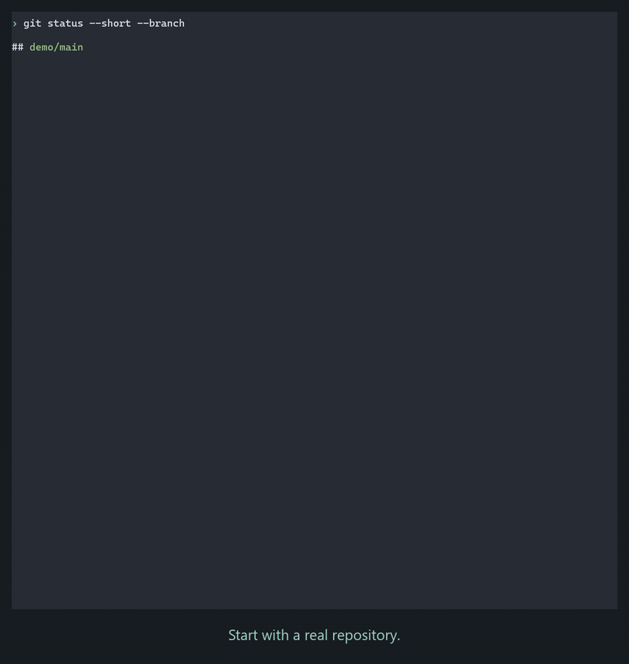
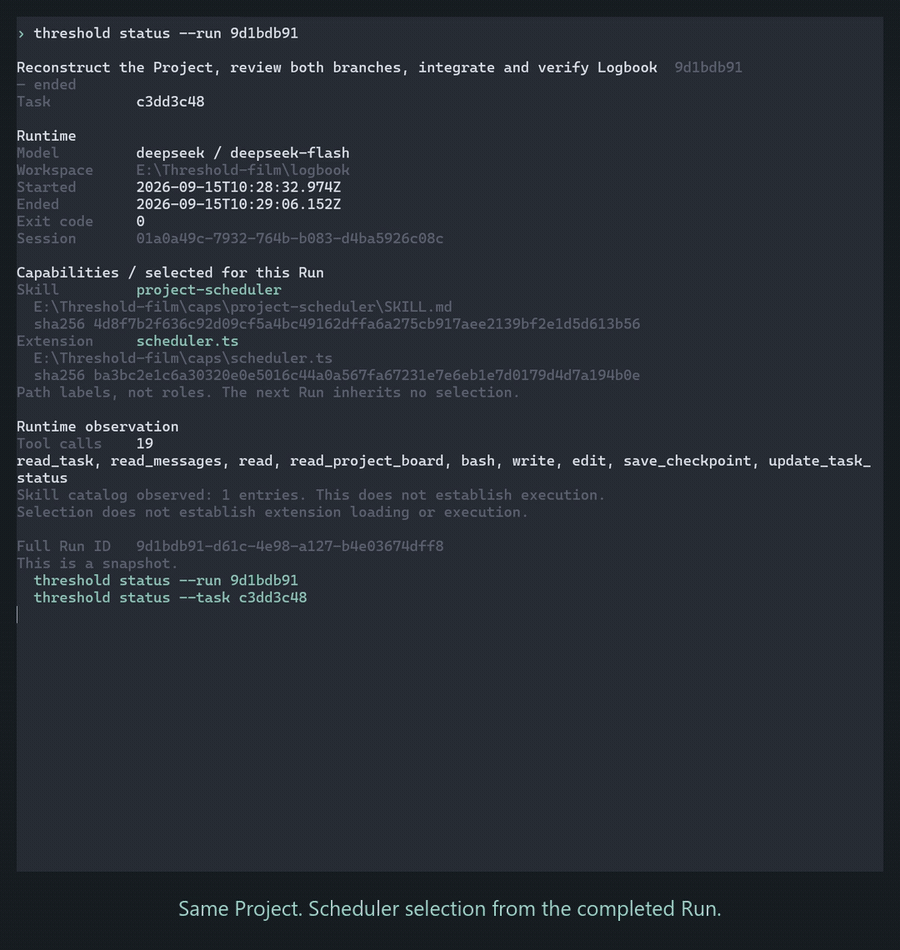

# Threshold

**Project persists. Agents come and go.**

Threshold is a small local service for continuing software projects across independent Agent sessions.
Give a Task to a Pi worker, keep its checkpoint and messages, then let a fresh worker inspect the project and continue.
You do not need to copy the previous conversation.

Early alpha: one machine, trusted local user. Pi runs the Agent; Git holds the code; SQLite holds project state.
Optional capabilities are not required for the first workflow.

[Report a problem or friction](https://github.com/Key-of-door/Threshold/issues/new/choose) ·
[Questions, experiments and community](https://github.com/Key-of-door/Threshold-capability/discussions) ·
English / 中文 welcome.

## See it in action

**The coordinator leaves. The work continues.** Two peer workers use separate Git worktrees;
a fresh coordinating Run reads Project state and Git, then reviews and integrates their work.



<details>
<summary>Different Runs. Different capabilities. Same Project.</summary>

Select a reviewer, compose GitHub read with it, then start a Run with no optional capabilities.
Messages carry findings between independent workers; the next worker checks them against the actual code.



</details>

These are edited recordings of the real CLI from September 2026; pauses are cut and captions are editorial.
Capability selection is shown separately from observed tool use. [Start here](#install) to try it yourself.

## Install

You need **Node 24.18+**, npm, Git, and a provider account/API key (or an existing Pi login).
Windows workers need Git for Windows Bash; WSL2 workers use Linux Bash.
Pi is pinned to **0.85.1** and installed as a dependency.

| Environment | Validation status for 0.2.0-alpha.3 |
| --- | --- |
| Windows x64 + Git for Windows Bash | Tested: installation, CLI, service and Pi workflows |
| Ubuntu 24.04 x64 on WSL2 | Tested: fresh npm installation, native Linux Node/Bash, interactive attach/detach, restart handoff and Project archive/restore |
| Native Linux, other WSL distributions, macOS | Not yet tested |

The WSL2 check used real Pi processes and a local deterministic model fixture; it did not
verify a live external model provider.
In WSL, install Node and Threshold **inside Linux**, and use Linux paths for your project,
data and Pi configuration. [WSL setup notes](docs/user-guide.md#wsl2).

Install the current alpha from [npm](https://www.npmjs.com/package/threshold-lite):

```sh
npm install -g threshold-lite@alpha
threshold --version
threshold --help
```

This release is **0.2.0-alpha.3**. To pin it, use `threshold-lite@0.2.0-alpha.3` instead of `threshold-lite@alpha`.
For a user-writable installation directory, use `npm install -g --prefix PATH threshold-lite@alpha`
and put `PATH` (Windows) or `PATH/bin` (Linux/macOS) on your shell's PATH.

<details>
<summary>Install from source or a local tarball</summary>

From a source checkout:

```sh
npm ci
npm pack
npm install -g ./threshold-lite-0.2.0-alpha.3.tgz
```

If you already have a `.tgz` package, use `npm install -g PATH_TO_PACKAGE.tgz`.

</details>

## First conversation — one terminal

Run each command separately and finish its prompts before entering the next command.
First, configure a model (skip this if Pi is already configured):

```sh
threshold setup
```

Enter a provider such as `deepseek`, a model ID such as `deepseek-flash`, and your API key
at the hidden prompt. The key is saved in Pi's local **plaintext** `auth.json`, never in Project
records. Setup makes no model call. See [provider setup](docs/user-guide.md#provider-setup)
for existing logins, environment variables and custom configuration directories.

Start the service in the background; this returns to the same terminal:

```sh
threshold service start
```

Create a folder yourself, or choose an existing project folder. Then register it:

```sh
threshold project create
```

Enter its absolute path, for example `E:\my-project` on Windows or `/home/me/my-project`
on Linux. If Git is not initialized, answer `y` to the initialization question; pressing
Enter means no. Existing files are kept.

Create a Task and answer the title/instructions prompts:

```sh
threshold task create
```

Choose that Task, select a model, and start chatting:

```sh
threshold run --attach
```

Optional Skill/Extension prompts can be left blank. No optional capabilities are needed.
Enter sends a message; `/detach` leaves the view while the worker continues. Use
`threshold run stop RUN_ID` when you want to end that worker.

`threshold service status` inspects the service. `threshold serve` remains available for foreground
diagnostics; only that mode needs a separate terminal for client commands.
Default data location is stable when you change directories: Windows `%LOCALAPPDATA%/Threshold`,
macOS `~/Library/Application Support/Threshold`, Linux `$XDG_STATE_HOME/threshold` or `~/.local/state/threshold`.
`--home PATH` overrides it; every command targeting that instance needs the same override.

## Work with explicit commands

Enter your project's Git repository (initialize one with `git init` if needed):

```sh
threshold project create
threshold task create --title "Fix path handling" --instructions "Inspect the parser, make a small useful change, test it, and save a checkpoint describing the remaining work."
threshold status
```

Creation returns a short Task ID. Replace `TASK_ID` below with that ID; unique prefixes and full IDs both work.
Choose your configured provider/model. This example uses DeepSeek:

```sh
threshold run --task TASK_ID --provider deepseek --model deepseek-flash --objective "Complete the parser part and its tests; leave CLI work for a later Run."
threshold status --task TASK_ID
threshold status --run RUN_ID
threshold message read --task TASK_ID
```

`run` starts a new worker and returns immediately. Check `status` again to observe progress.
An ended Run is not automatically a completed Task. Task detail includes instructions, checkpoint and recent Runs;
the worker can explicitly update Task status and leave messages.

To talk to the same worker over multiple rounds, add `--attach` when starting it:

```sh
threshold run --task TASK_ID --provider deepseek --model deepseek-flash --attach
# Later, reconnect to that Run:
threshold run attach RUN_ID
```

Enter sends input; `/detach` or Ctrl+C leaves the view without stopping the worker. An interactive Run
waits after each reply until you explicitly `threshold run stop RUN_ID`. Attaching to an existing
background Run does not change its lifetime. Conversation is temporary; checkpoint, Message and Git
remain the handoff path. See [interactive Runs](docs/user-guide.md#interactive-runs).

Background Runs have a **3-minute** turn limit; interactive Runs have no fixed conversation lifetime.
Default service limits are **3 unsettled Runs** and
**100 historical starts per data directory**. These are startup limits, not token or spending budgets.
An interactive worker waiting for input still occupies its slot and worktree.
`threshold service start --help` explains the configuration. The same managed worktree cannot have two unsettled workers.

## Come back later

```sh
threshold service stop
# Later, possibly in a new terminal:
threshold service start
# In the same terminal, anywhere inside the same project:
threshold status
threshold status --task TASK_ID
threshold run --task TASK_ID --provider deepseek --model deepseek-flash --objective "Inspect the current project and checkpoint, then complete the next useful part."
```

The new worker gets persisted project state and re-observes Git/files; it does not resume the old conversation.
If you used `--agent-dir` or `--home`, use those same settings when restarting.
Outside a registered repository, `threshold status --all` lists Projects and Tasks; `--project ID` selects one explicitly.

To interrupt **one worker**: `threshold run stop RUN_ID`.
To stop the **service and its workers**: `threshold service stop`.
Bare `threshold stop` takes no action and explains the choice. Project data is retained.

After an unclean restart, an `unknown` Run still holds its slot/worktree. Once you independently confirm
the old worker is gone and the workspace is reusable, use [explicit workspace recovery](docs/user-guide.md#recover-an-unknown-runs-workspace).
The old Run outcome remains unknown.

Projects can also be archived and restored without deleting files or history. See
[put away a Project and return later](docs/user-guide.md#put-away-a-project-and-return-later).

## Upgrade

When ready to end the current workers, stop the service normally, back up the closed home directory,
then update the package and restart:

```sh
threshold service stop
# Back up the closed service home before the schema v7 upgrade.
npm install -g threshold-lite@alpha
threshold --version
threshold service start
```

Use your existing `--home` and `--agent-dir` overrides if applicable. Project history is retained.
Version `0.2.0-alpha.3` adds schema **v7** for Project archives. Existing Projects remain active.
Older services refuse a v7 database; downgrading requires the pre-upgrade backup.
A running service does not update just because npm installed a newer CLI.
See [troubleshooting](docs/user-guide.md#technical-errors-and-stopping) before deleting
any runtime marker or retrying a failed startup.

## More, when needed

- `threshold COMMAND --help` explains flags and gives an example.
- Human-readable output is default. Use `--json` for scripts; IDs remain complete in JSON.
- Terminal output uses restrained color and a small face only on top-level help/startup/attach.
  Use `--no-color` or `NO_COLOR` for monochrome, and `--ascii` for simple symbols. Pipes and
  `TERM=dumb` use plain output automatically; no special fonts are needed.
- Use `--instructions-file PATH` or `--body-file PATH` for long Task/message text.
- [User guide](docs/user-guide.md): configuration, messages, worktrees, capabilities, technical errors and current limits.
- [Changes from the prototype CLI](docs/cli-migration.md): new home, output and stop commands.
- [Optional Threshold-capability cookbook](https://github.com/Key-of-door/Threshold-capability): select skill/extension paths per Run; nothing is installed or activated automatically.

Normal development does not need a deployment approval. Current Risk STOP demonstrates only local `fake_deploy`;
it is not a universal shell/network safety layer or a real remote-operation guarantee.
The service listens only on loopback and is for a trusted local OS user. Do not expose it as a multi-user/network server.

## Community and feedback

**Tell us what you're trying to do, and what happened.** Small problems and rough observations
are welcome; you do not need to prove a bug or arrive with a finished solution.

- Problems using Threshold, confusing behavior or workflow improvements → [Threshold Issues](https://github.com/Key-of-door/Threshold/issues/new/choose).
- Questions, capabilities, experiments and community ideas → [Threshold-capability Discussions](https://github.com/Key-of-door/Threshold-capability/discussions).
- Bugs in the cookbook's scheduler, read-doc, github-read or example code → [Threshold-capability Issues](https://github.com/Key-of-door/Threshold-capability/issues).

Not sure where it belongs? Start where it makes sense to you; we can help find the right place.
**English and 中文 are both welcome.** 小问题也欢迎，不需要先形成一个漂亮结论。
Please remove API keys, credentials and sensitive project data from text, logs and screenshots.
Do not attach or paste the full `auth.json`. 请勿上传完整凭据文件。

## License

Licensed under [Apache-2.0](LICENSE).
