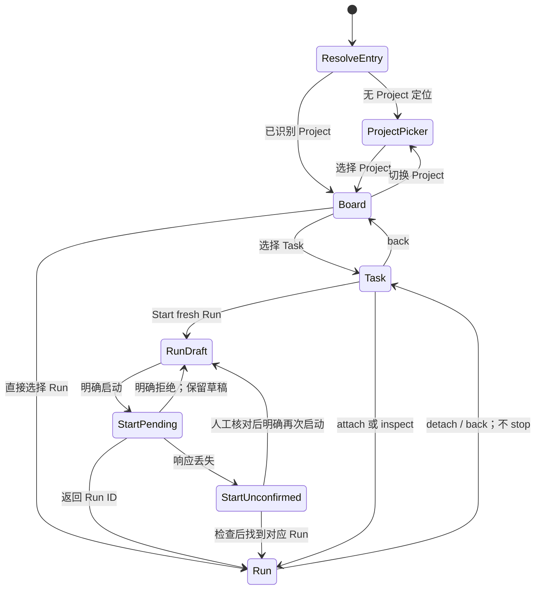
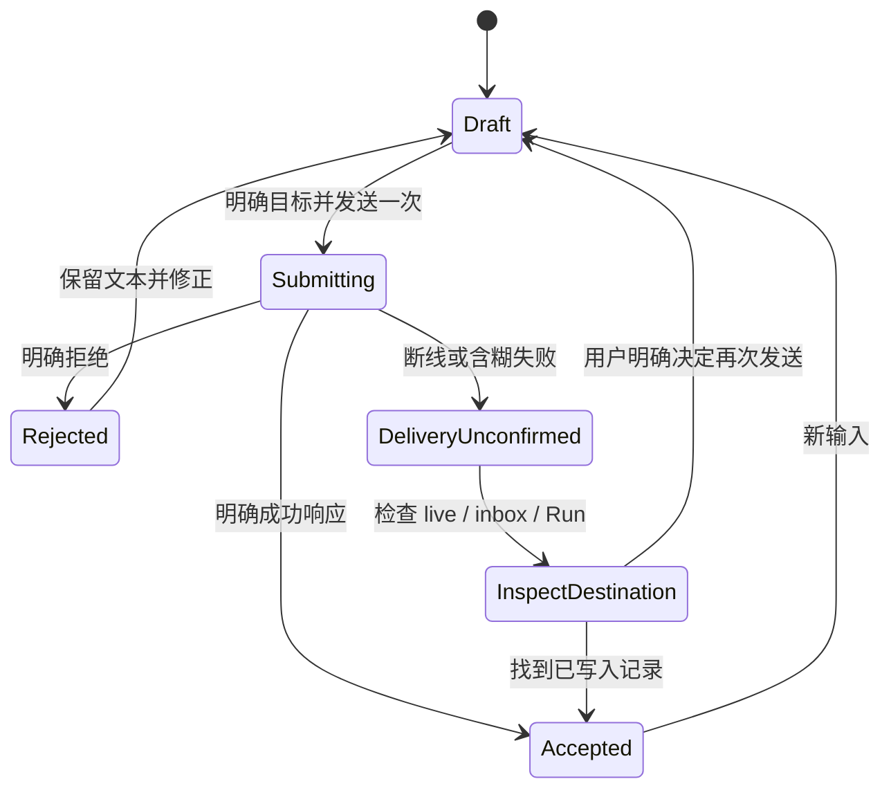

# Threshold TUI — wireframe 与交互状态机 v1

2026-09-26 · 设计原型，待试用；不是已实现的产品行为。

后续状态：已按本稿接入首版本地终端 dogfood；实际可用范围和与 wireframe 的差异见 [TUI dogfood](../tui-dogfood.md)。本稿保留为交互约束，不代表所有提案都已实现。

本稿承接第一轮讨论，落实界面、动作与数据来源。第一版用现有公开数据验证 Project / Task / Run 的工作流程，不实现完整 token streaming、完整 tool result、持久活动重建，不读取 Pi stdout。所有交互预览使用虚构 fixture，不连接用户 service，不调用模型。

## 1. 视图与布局

Project 首页就是 Board。对象归属不是强制向导：已注册 cwd 直接进入 Board，其他位置进入 Project picker；显式 Project/Task/Run 定位优先，显示完整归属面包屑。打开界面不启动 Run。

```text
Threshold                                       Service / home / connection
Projects > threshold > Task TUI exploration > Run 9af31
───────────────────────────────────────────────────────────────────────────
Project Board      Task detail                     Run detail / live
Tasks + Runs       Overview | Checkpoint           Public activity | Inspect
service capacity   Messages | Git                  execution / configuration
                   Start fresh Run                explicit input target
───────────────────────────────────────────────────────────────────────────
Contextual actions / keyboard hints                last successful refresh
```

宽窗口的 Task 页允许左侧保留紧凑 Task 列表；Run 页优先给正文与输入空间，不常驻管理者/Agent pane。窄窗口切成单页，通过面包屑返回，不缩小文字、不删去详情字段。原型提供“专注单页 / Task 列表常驻”布局选项，用于比较上下文切换成本。

| 视图 | 默认可见 | 一次明确操作可达 | 主动作 |
| --- | --- | --- | --- |
| Project picker | Project 名称、ID、repo path、归档标记 | 显示归档、service 详情 | 选择 / 注册 |
| Board | Task 标题、工作评估、最新 Run、所有 unresolved Run、checkpoint 预览、message count、service 容量 | 完整 Task、Run inspect、归档 | 新建 Task |
| Task overview | 标题、instructions、状态、最新 checkpoint 来源/时间、recent + unsettled Runs | checkpoint 全文、messages、Git | Start fresh Run |
| Task messages | 总记录数、来源 client/Run、时间、正文、分页状态 | 来源 Run；解析得到的来源 Task | 写入本 Task inbox |
| Task checkpoint | 最新全文、Run、时间、历史 Git 快照 | 来源 Run / 当前 Git | 查看当前 workspace |
| Task Git | 明确选中的 workspace、branch、HEAD、status、观测时间/错误 | 按需只读 diff / 文件查看 | 刷新所选 workspace |
| New Run | Task、objective、workspace、执行模式、模型摘要、selected capability 数量 | 完整请求配置 | 启动一次 |
| Run activity | 归属、Run status、live phase、模式、workspace、公开活动、输入目标 | Inspect、Task、配置详情 | 输入 / detach |
| Run inspect | objective、执行模式、时间、退出信息、error、配置、capabilities、runtime observation | 完整 ID、session ID、SHA、recovery | 根据状态 stop / recover / fresh Run |
| Service detail | home、连接状态、地址、Pi config（可用时）、容量、unresolved Runs | 现有 service CLI 操作 | 检查 / 显式启动或停止 |

不把 session ID 提升成一级导航；仍保留可复制的诊断字段。Board 的未知占用和 Run 的错误不得藏在详情页之后。

## 2. 三条高频路径

### A. 从 Project 开始一棒工作

1. Board → 选择 Task → 检查 instructions / checkpoint / messages / workspace。
2. Start fresh Run → 编辑新 Run 草稿。默认无 Skill/Extension；不继承上一 Run 的选择。
3. 选择 interactive 或 background。默认建议 interactive，但启动前始终可见、可改。
4. 启动返回 Run ID 后进入 Run 页；服务接收启动不代表模型已成功开始。
5. interactive 等待输入仍是 running、仍占 slot；background 完成一轮后按原策略结束。
6. 结束页显示真实 Task 状态、最新 checkpoint 来源与时间。没有本 Run checkpoint 就明确写出。
7. Fresh Run 与 Back to Task 同时可达；不出现“恢复旧 Agent”的默认操作。

### B. 检查其他 Task 发来的 finding

Board message count → Task Messages → 阅读正文与来源 → 打开相关 workspace/Git → 按需写一条 client Message 或更新 Task 状态。

阅读不消耗 Message、不标记全局已读、不改变 Task 状态、不自动唤醒 Run。矛盾记录按原顺序共存。分页用 nextAfter / hasMore，展开正文不自动摘要。来源 Task 由 from_run_id 查 Run 再查其归属，解析失败只显示已知 Run ID。

### C. 离开和重新进入 Run

Run → Detach / Back to Task → Board → 同一 Run：仍 active 则 attach；ended 则只读 inspect；unknown 则 inspect + 检查占用。attach 不改变 Run 启动模式或 deadline。退出 TUI 不停止任何 worker/service。

## 3. 启动配置

常驻摘要建议：`interactive · provider/model · thinking max · ctx 1M · out 384K · 0 selected`。workspace 和 objective 是单独字段，不挤进徽标。

| 字段 | 新 Run 草稿 | 运行中 / 历史 Run |
| --- | --- | --- |
| Provider / model / thinking | 根据现有 models catalog 选择或明确输入 | 只读，requested 与 observed 分开 |
| Context / output | 可选覆盖；不超过本地配置上限；不支持时说明 | 启动观测值；不是已用量或累计预算 |
| Execution mode | interactive / background | 只读 |
| Timeout | background 默认 service 配置（当前 1800 秒）；0 禁用 | 只读 deadline 配置和实际 stopReason |
| Interactive timeout | 隐藏编辑框，显示“不适用” | 不显示虚构倒计时 |
| Workspace | Project 根或现有同 repo worktree；明确绝对路径 | 实际 workspace_path |
| Objective | 可选；不修改 Task instructions | 保留全文 |
| Skills / extensions | 显式 paths，可多个；默认空 | 路径、SHA；selected 不代表已加载或执行 |

运行中点击配置只打开只读详情。`/model` 等命令仅在 new-Run 草稿中编辑；在 Run 中指向查看配置或显式创建新草稿。不提供不存在的热切换。失败保留草稿；启动结果不确定时先查 Run，不自动重新 POST。

## 4. 状态机：分开维护四个维度

UI route、连接状态、持久 Run 状态、live phase 分开存储。下图是客户端交互模型，不新增 core 状态枚举。



| 维度 | 取值 / 展示 | 转换依据 |
| --- | --- | --- |
| Client connection | connecting / connected / disconnected / service unavailable | 本客户端请求结果；保留最后成功快照与时间 |
| Persistent Run | starting / running / ended / unknown | 服务返回的 Run record |
| Live observation | starting / working / waiting for input / settled / stopping / ended / unavailable | 当前 service process 的 live snapshot |
| Execution mode | interactive / background / not recorded | execution 元数据；旧记录不猜测 |

断线只改变 connection，不修改 Run status。界面停止展示“当前 live”，保留标明时间的旧快照；重连重新查询。服务重启后若返回 unknown，就展示 unknown；活动窗口缺失显示 unavailable，不伪造空白新聊天或零调用。

stop 请求成功只表示请求被接收。先显示“已请求停止”，等待观测；最终 ended / error / exit code / stop reason 按记录展示。ended 用中性色，不能等同 success / Task done。

## 5. 写入状态机与输入目标



| Composer / action | 目标和语义 | 成功后的文案 |
| --- | --- | --- |
| Run input | `/runs/:id/input`；working 时可能排队；idle 时开始下一轮 | 已被 Pi 接受；不代表已处理 |
| Task inbox | `/tasks/:id/messages`；source=client；不假扮 Run | 已写入 Task inbox；不自动通知或启动 Run |
| Task status | `/tasks/:id/status`；status + 非空 note | 已记录工作评估；不停止 Run |

两种 composer 不共享未发送文本；切换目标保留各自本地草稿。提交中禁止重复发送。页面离开、POST 超时、错误响应不能统一当作“未写入”。临时输入内容不自动转成持久 Message。

Task 页没有默认聊天框，进入 Messages 后才有 inbox composer。Run 页 composer 持续显示 Project / Task / Run 目标。Run ended、unknown、正在停止或断线时禁用发送并保留草稿。

## 6. 特殊操作与异常路径

| 情况 | 用户看到 | 可用动作 / 边界 |
| --- | --- | --- |
| 未注册仓库 | cwd path + Register Project | 不自动 git init；非 Git 目录显式选择初始化或返回 |
| 空 Project / Task | 无 Tasks / 无 Runs / checkpoint 未保存 | Create Task / fresh Run；不创建占位 Agent |
| Project archived | 归档标记，历史可读 | Restore；禁止新 Task/Run |
| 容量满 | 当前 home 总占用；指出 unknown / idle 占用 | inspect；不自动 stop、不删历史重置配额 |
| 模型或 capability 启动失败 | 明确错误、已生成的 Run ID（若有）、保留草稿 | inspect；不把本地 ceiling 说成 provider 拒绝 |
| 活动被截断 | 窗口顶部缺口标记 | 查看剩余公开活动；不显示“展开全部” |
| 服务重启，活动不可用 | unavailable + 持久 Task/Run 信息 | Task / checkpoint / messages / Git |
| unknown Run 未恢复 | slot/workspace 仍占用；outcome unknown | Inspect + Recover workspace |
| 恢复 workspace | 显示完整 Run ID、路径、独立检查确认、非空 note | 仅记录人工确认并释放旧占用；状态仍 unknown |
| Git 观察失败 | 错误 + workspace + 观测时间 | 重试读取；不能显示 clean |
| 退出 TUI | 退出视图 | 不请求 stop；未确认的发送仍保持未确认 |
| Stop service | 操作范围明确为该 home 的所有 managed workers | 独立操作入口，不复用 Run stop；不与退出绑定 |

Run stop 是明确命名的直接动作，避免每次多弹泛化确认；service stop 与 workspace recover 使用专门表单表达范围或已有确认要求。未知进程不能由 UI 宣称已被停止。

## 7. 键盘、鼠标、焦点与滚动

- 命令面板是主要可发现入口；展示动作名称、作用对象与快捷键。无输入焦点时 `?` 打开帮助，`b` 回 Board，`n` 新 Run，`Esc` 关闭最内层详情/表单或回上层。
- 所有点击动作有键盘路径；列表用上下键、Enter；Tab 在区域与控件间移动。输入框内不捕获普通字母或导航快捷键；IME composing 时不提交。
- composer 支持多行与粘贴。首版采用显式发送按钮与可支持的 Ctrl+Enter；terminal 不支持组合键时从命令面板发送。Enter 换行，不因多行粘贴逐行发送。
- slash 命令有本地命令完成提示和明确作用域；未识别 slash 文本保留为文本，不执行猜测命令。
- 展开目标放在独立标题/按钮上，正文用于选择复制。不能将整段 Message 点击绑定折叠，破坏文本选择。
- live 自动跟随仅在用户位于底部时生效；向上滚动后暂停，显示新增活动数量与“回到底部”。刷新不抢焦点、不覆盖草稿、不重排用户正在选择的正文。
- 鼠标报告模式下保留终端原生复制的退路，真实 Windows terminal 验证后再冻结按键。浏览器 wireframe 的 Tab/Enter/Esc 不能当作终端兼容性证明。
- `NO_COLOR` / ASCII / 窄窗口仍区分状态；不要求 Nerd Font。保留现有 calm / modern / technical 方向。

## 8. 现有数据映射与 CLI 信息保全

| 来源 | 用途与注意事项 |
| --- | --- |
| `GET /status?includeArchived=true` | Project/Task 索引、unresolved Runs；无完整 instructions/checkpoint |
| `GET /lookup` | 显式 ID/prefix 定位；不把短 ID 当真正存储键 |
| `GET /projects/:id/board` | Task previews、latest + unsettled Runs、home-wide resources |
| `GET /tasks/:id` | 全文 instructions、最新 checkpoint、最近 5 Runs、messageInbox、当前注册根 Git、controlled state |
| `GET /tasks/:id/messages` | 正文分页；记录数不是未读数；保留 id/source/from_run_id/created_at |
| `GET /runs/:id` | 完整 Run、execution、error、recovery、requested/effective、capabilities、runtimeObservation；该客户端路由本身不带 currentGit |
| `GET /runs/:id/live?after=...` | phase/active/policy/queued/resources + 有限公开活动；游标缺口与 unavailable 必须呈现 |
| `GET /models` | 配置选择；credential presence 不保证连通、额度或兼容性 |
| 本地现有 service discovery | home、地址、running/stale/unconfirmed；不等于全系统进程盘点 |
| 本地显式只读 Git 操作 | Run worktree status/diff；以实际 workspace_path 定位；按需执行，不能以 Project 根结果冒充 |

第一版不声称拥有完整 Run 历史列表、历史 checkpoint 分页或完整 Project timeline。Task 的 recentRuns 只有最近 5 条；合并 Board unsettledRuns 保证更早但仍占用的 Run 可见，并按 ID 去重。旧 Run 可通过已知 ID inspect。

服务当前返回的 `tool_start` / `tool_end` 不包含完整结果和稳定调用关联 ID；首版保留按事件顺序的摘要列表，不凭名称把并行同名工具配对成伪造结果块。只折叠确实已持有的长回复 / Message / checkpoint，截断内容仍明确标记缺失。

CLI 保全验收逐项对应 `src/cli-display.mjs`、`src/cli-attach.mjs`：

- Board：work assessment、所有 unsettled Runs、error、workspace、checkpoint preview、message count、全 home 容量、历史启动预算、background 默认 timeout。
- Task：instructions 全文、checkpoint 全文/Run/时间、recent Runs 的 objective/execution/error/workspace、Git 分支/HEAD/status/error、归档状态。
- Run：provider/model、objective、Task ID、workspace、execution/stopReason、started/ended/exit/session、完整 ID、requested/effective、caps 路径和 SHA、runtime tool count/names、可用 skills 观察、recovery note/time。
- Messages：id、source、from_run_id、created_at、完整 body、hasMore/nextAfter；不删除冲突信息。
- Service：home、URL、Pi config（可用时）、stale/unconfirmed 解释、诊断入口；不显示 credential 值。
- 缺失语义：not recorded / not observed / unavailable / failed 与 none / zero 分开。
- Risk STOP：已有 fake_deploy 决策状态及人类 CLI 入口可在 Task 详情按需打开；不制作通用工具批准按钮。

## 9. Wireframe 的范围与试走脚本

交互预览包含 Board、Task 的 Overview/Checkpoint/Messages/Git、New Run、Run activity/inspect、Project picker、service 详情和恢复表单。界面顶部的“场景”属于设计预览控制，不是未来产品导航。所有状态/动作均为 fixture。

首轮试走：

1. Board → Task → Messages → 写入 client note → 回 Board；记录数变化但 Task 状态不变。
2. Task → New Run → background + 1800 秒 → 启动 → detach → 再进入；mode 不变化。
3. Run 中点配置，确认只能 inspect；输入只进入该 Run，不增加 inbox count。
4. 切换断线场景，确认保留旧快照、禁用写入、无“Run 已结束”推断。
5. 切换结束场景，确认 Task 仍 in_progress，checkpoint 仍来自旧 Run，fresh Run 可达。
6. 切换 unknown 场景，检查占用、输入禁用、独立确认 + note；恢复后 unknown 不变但旧占用释放。
7. 切换输入未确认场景，确认不会自动重发；可以检查活动后由用户决定。
8. 在窄窗口切换 tabs、查看路径和长文本，比较“专注单页 / Task 列表常驻”；终端 IME/mouse/clipboard 留到真实 TUI spike 验证。

该 wireframe 并未模拟每个后端错误、容量竞态或所有 CLI 命令；表格与状态机是后续实现的约束，不意味着点击原型已实现这些服务行为。

## 10. 本轮确定的实现顺序

1. 试走本稿的对象导航、输入目标、生命周期与异常状态。
2. 真实终端 spike：接现有 service 的只读视图，再接已有写入操作；验证 mouse/IME/resize/clipboard，不改领域实体。
3. 持续使用后，再单独决定 Run public activity interface；其 streaming、tool result、diff、重启后有限重建均不作为本轮前置工作。

边界：不为 TUI 新增领域实体或改变执行语义；为观察已有行为，可以单独增加必要的只读 / public-event surface。
